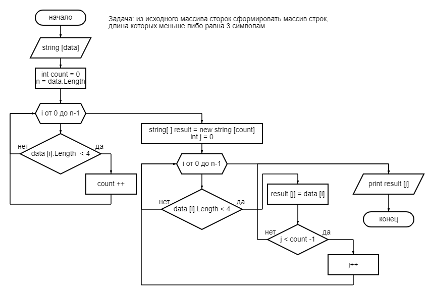

# Итоговая проверочная работа по блоку обучения № 1
# Группа Разработчик 3855. ВундерАГ

Алгоримт действий по выполнению задания:
1. Создаем репозиторий на GitHub/
2. На базе программы VS Code создаем папку с файлом readme.md.  В этом файле описываем алгоритм нашей работы над заданием.
3. Выгружаем папку на GitHub заранее, чтобы использовать контроль версий в процессе работы, а именно выгружать разные этапы работы с комментариями к ним. Это требование по условию задания
4. Рисуем блок-схему алгоритма основной части кода (метода кода), используя редактор блок-схем. Например, онлайн редактор Program4you [ссылка](https://programforyou.ru/block-diagram-redactor)
5. Для примера,
 
6. Пишем программу для нашей задачи на базе C# for VS Code.
7. Доабавляем в основную папку файл gitignorе, чтобы не выгружать лишнюю информацию на GitHub.
8. Каждый новый файл или каждое изменение файла добавляем в раздел проиндексированных файлов и комментируем. 
9. Выгружаем депозиторий с выполненым заданием на GitHub.

